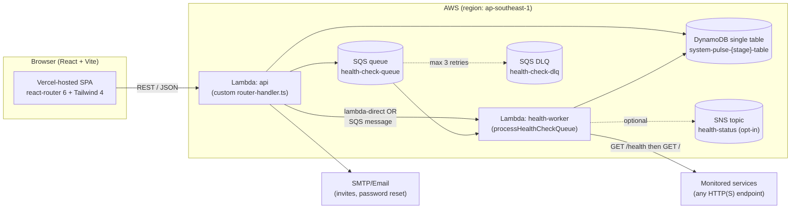
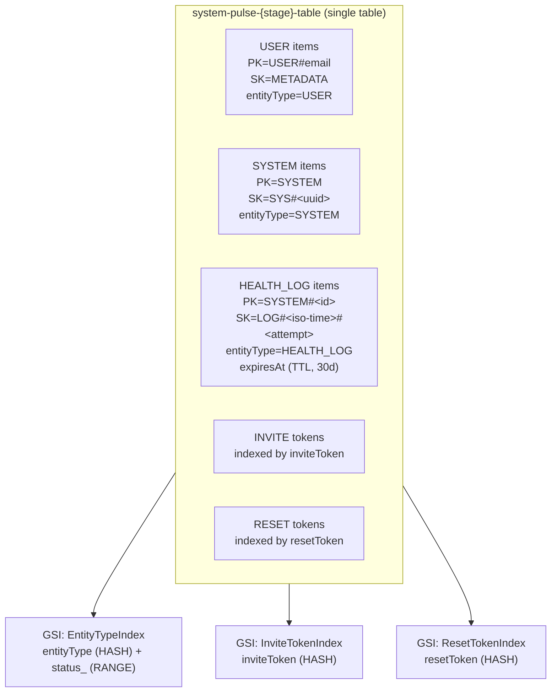
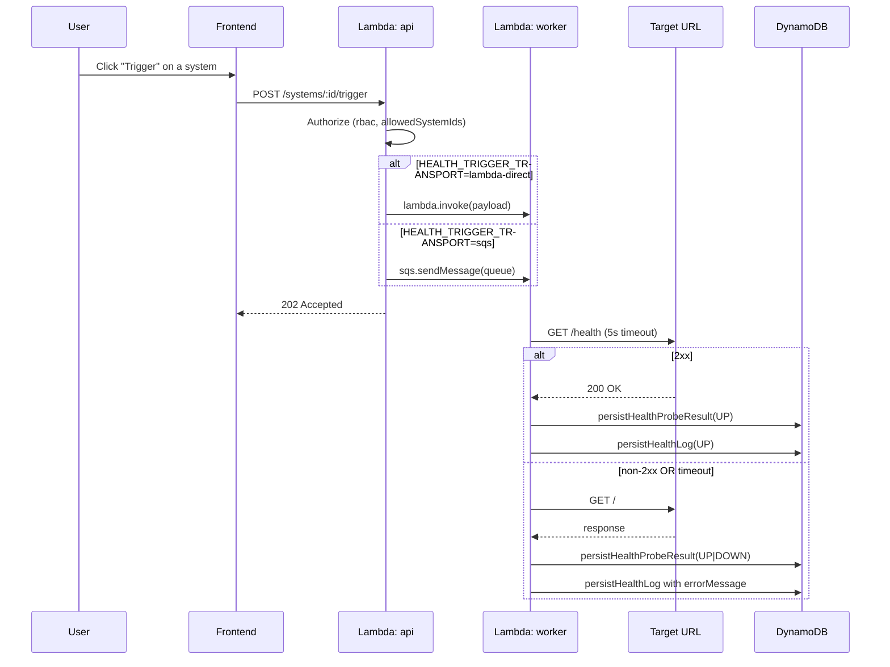

# System Pulse

> A self-hosted uptime and health-check platform for the services your team actually depends on.

System Pulse lets administrators register URLs to monitor, dispatches health probes on demand or via background workers, and surfaces a real-time status dashboard with a 30-day rolling history of every probe result. Invite-based onboarding, per-user system access lists, and three-tier roles keep monitoring scoped per team.

🌐 **Live demo:** [system-pulse-brown.vercel.app](https://system-pulse-brown.vercel.app)

---

## Table of Contents

1. [What It Does](#what-it-does)
2. [System Architecture](#system-architecture)
3. [Tech Stack](#tech-stack)
4. [Repository Layout](#repository-layout)
5. [Database Design](#database-design)
6. [API Reference](#api-reference)
7. [Health-Check Engine](#health-check-engine)
8. [Roles & Onboarding](#roles--onboarding)
9. [Deployment](#deployment)
10. [Local Development](#local-development)
11. [Environment Variables](#environment-variables)

---

## What It Does

- **Register systems** by URL, choose a deployment mode (`render` or `standard`), and Pulse runs an immediate probe on creation.
- **Probe on demand** from the dashboard or have the backend fan out probes through SQS for batched, resilient checking.
- **Persist every probe** as a `HEALTH_LOG` row with response code, latency, attempt number, and trigger source — auto-expired after 30 days via DynamoDB TTL.
- **Email-based onboarding**: superadmins invite teammates by email; the recipient activates their account through a tokenized link.
- **Per-user access scoping**: assign each user the specific systems they're allowed to see (`allowedSystemIds`).
- **Forgot-password flow** with a separate token store (`ResetTokenIndex` GSI).
- **Render wake-up mode**: built-in delay logic so monitoring a Render free-tier service doesn't always show "DOWN" because of cold-start sleep.

---

## System Architecture



**Why two Lambdas?** Health probes can be slow (Render wake-ups can take 60-90 seconds). Decoupling them from the API request path means user-facing endpoints stay snappy, and the worker can run with a longer timeout. The transport between API and worker is configurable (`HEALTH_TRIGGER_TRANSPORT=lambda-direct|sqs`) so you can opt into SQS for batched probes when scale grows.

**Probing strategy:** the worker tries `GET <url>/health` first, then falls back to `GET <url>` — if either returns 2xx, the system is `UP`; otherwise `DOWN`. Status is recorded along with response time in milliseconds.

---

## Tech Stack

| Layer | Backend | Frontend |
|---|---|---|
| Language | TypeScript 6, Node.js 20 (ESM) | TypeScript 5, React 18 |
| Runtime | AWS Lambda | Browser (Vercel) |
| Build | `tsc` → `dist/` (ESM output) | Vite 5 |
| HTTP | Custom router (`router-handler.ts`) on top of `aws-lambda` types | `fetch` |
| Data | DynamoDB via `@aws-sdk/lib-dynamodb` | — |
| Queue | SQS via `@aws-sdk/client-sqs` | — |
| Notifications | SNS via `@aws-sdk/client-sns` | — |
| Worker invoke | Direct Lambda invoke via `@aws-sdk/client-lambda` | — |
| Auth | Custom token in `users/invite/accept` & `auth/login` | localStorage + `useAuth` hook |
| Email | nodemailer (SMTP) | — |
| Validation | yup | — |
| ID generation | uuid v4 | — |
| Routing | URL → handler table with `:param` matching | react-router-dom 6 |
| Styling | — | Tailwind CSS 4 + custom CSS |

No Express, no Sequelize. The backend is a thin functional layer over AWS SDK — every "controller" is a Lambda function that takes an `APIGatewayProxyEvent` and returns a response, and `router-handler.ts` is a small dispatcher that maps `{method, path}` to those handlers.

---

## Repository Layout

This is a **monorepo**: the backend Lambda code and the frontend SPA live in the same repository.

```
system-pulse/
├── .github/workflows/deployment.yml   # 600+ line idempotent infra+code deploy
├── backend/
│   ├── package.json                    # Node 20, ESM, AWS SDK v3
│   ├── tsconfig.json
│   └── src/
│       ├── handler.ts                  # Re-exports every Lambda function
│       ├── router-handler.ts           # Single-Lambda router for /api fan-in
│       ├── config/                     # config.ts, db.ts (DDB doc client)
│       ├── functions/
│       │   ├── auth/                   # login, forgot-password, reset-password
│       │   ├── user/                   # invite, accept, list, get, delete,
│       │   │                           # assign-system-access
│       │   └── health/                 # check-health, list-systems,
│       │                               # delete-system, trigger-health,
│       │                               # process-health-queue, get-system-logs
│       ├── services/
│       │   ├── health-service.ts       # Persist + probe + log
│       │   ├── user-service.ts
│       │   ├── email-service.ts        # SMTP via nodemailer
│       │   ├── notification-service.ts # SNS publish (opt-in)
│       │   ├── queue-service.ts        # SQS send/receive
│       │   └── worker-invoke-service.ts # Direct Lambda invoke
│       ├── types/                      # health, health-events, user
│       ├── utils/
│       │   ├── actor-auth.ts           # Token verification
│       │   ├── error-handler.ts        # Shared CORS + error helpers
│       │   ├── frontend-url.ts         # Render wake-up URL resolution
│       │   ├── health-workflow.ts      # resolveDeploymentMode()
│       │   ├── rate-limit.ts
│       │   ├── rbac.ts                 # Role-based access checks
│       │   ├── parse.ts, password.ts
│       ├── validation/                 # yup schemas
│       └── scripts/seed-users.ts       # Bootstrap superadmin
└── frontend/
    ├── package.json                    # React 18, Vite 5, Tailwind 4
    ├── vite.config.ts
    ├── vercel.json
    ├── public/favicon.svg
    ├── assets/                         # Logo variants (light/dark, with/without name)
    └── src/
        ├── App.tsx                     # Routes + role guards
        ├── main.tsx
        ├── components/                 # Nav, AestheticSelect
        ├── hooks/                      # useAuth, useTheme
        ├── pages/
        │   ├── Login.tsx
        │   ├── ForgotPassword.tsx, ResetPassword.tsx
        │   ├── AcceptInvite.tsx
        │   ├── AdminDashboard.tsx     # Big page (~27KB)
        │   ├── TesterDashboard.tsx
        │   ├── Systems.tsx, Invite.tsx, AssignAccess.tsx
        │   └── Home.tsx
        ├── services/api.ts             # Single typed API client
        ├── styles/index.css            # Tailwind + custom theme
        └── utils/health-status.ts      # Status badge helpers
```

---

## Database Design

System Pulse uses **DynamoDB single-table design**: one table holds users, systems, invites, password-reset tokens, and health logs, distinguished by an `entityType` attribute and PK/SK prefixes. Three GSIs index entity-type lookups, invite token lookups, and reset-token lookups.



**Key design choices:**

- **Single table** keeps reads cheap and avoids cross-table joins (DynamoDB has none anyway). All entities share the same partition strategy.
- **`entityType` discriminator** on every row makes type-aware queries trivial via the `EntityTypeIndex` GSI.
- **Health logs are time-prefixed** (`SK=LOG#{iso}#{attempt}`) so a sorted query returns the most recent N attempts in one round trip.
- **TTL on `expiresAt`** auto-purges health logs after 30 days — no cron job needed.
- **Invite and reset tokens** get their own GSIs because they're looked up by random opaque token, not by user.
- **Provisioned by CI** with `BillingMode: PAY_PER_REQUEST` so you pay only for actual reads/writes — fine for monitoring workloads that are bursty.

### Domain types (TypeScript)

```typescript
// User
interface User {
  id: string;
  email: string;
  full_name: string;
  role: "superadmin" | "admin" | "tester";
  status_: "Active" | "Pending" | "Suspended";
  createDate: string;
  passwordHash?: string;
  allowedSystemIds?: string[];   // per-user system access list
}

// HealthCheck (a "system")
interface HealthCheck {
  id: string;
  name: string;
  url: string;
  deploymentMode?: "render" | "standard";
  status?: "UP" | "DOWN" | "UNKNOWN";
  createDate: string;
  lastChecked?: string;
  lastResponseCode?: number;
  responseTimeMs?: number;
}

// HealthLog (per probe result)
interface HealthLogRecord {
  systemId: string;
  status: "UP" | "DOWN" | "UNKNOWN";
  checkedAt: string;
  responseCode?: number;
  responseTimeMs?: number;
  checkedUrl?: string;     // /health or /
  attempt: number;
  triggerSource: string;   // "manual" | "system-create" | "queue" | ...
  errorMessage?: string;
  expiresAt: number;       // unix epoch, 30 days out
}
```

---

## API Reference

| Method | Path | Auth | What it does |
|---|---|---|---|
| `POST` | `/auth/login` | none | Email + password → access token |
| `POST` | `/auth/forgot-password` | none | Email a password-reset link |
| `POST` | `/auth/reset-password` | reset token | Consume token + set new password |
| `POST` | `/users/invite` | superadmin | Email an invite link to a new teammate |
| `POST` | `/users/invite/accept` | invite token | Set password + activate account |
| `POST` | `/users/:id/systems` | admin+ | Replace a user's `allowedSystemIds` |
| `GET` | `/users` | admin+ | List users |
| `GET` | `/users/:id` | admin+ or self | Fetch a user |
| `DELETE` | `/users/:id` | superadmin | Remove a user |
| `GET` | `/systems` | any auth | List systems (filtered by `allowedSystemIds` for testers) |
| `POST` | `/systems` | admin+ | Register a new system + run initial probe |
| `DELETE` | `/systems/:id` | admin+ | Delete a system + its logs |
| `POST` | `/systems/:id/trigger` | any auth | Fire an on-demand probe |
| `GET` | `/systems/:id/logs` | any auth | Recent probe history (default 20, max 100) |

Every response is wrapped with global CORS headers (`Access-Control-Allow-Origin: *`, full method/header list) so the browser SPA can call directly. `OPTIONS` preflights short-circuit at the router with status 204.

---

## Health-Check Engine



**Render wake-up mode:** when `deploymentMode = "render"`, the worker waits `RENDER_WAKEUP_DELAY_SECONDS` (default 90s) before declaring a service `DOWN` — Render free-tier services often need a cold-start window before they respond.

**Skipping logs in dev:** set `ENABLE_HEALTH_LOGS=false` to silence log writes (the system status is still updated).

**Optional SNS notifications:** set `ENABLE_SNS_NOTIFICATIONS=true` and the worker publishes status changes to the `health-status` topic — wire up email/SMS subscribers from the AWS console.

---

## Roles & Onboarding

| Role | What they can do |
|---|---|
| **superadmin** | Everything: invite/delete users, manage systems, see every system, change anyone's access list |
| **admin** | Manage systems, invite/delete users, see everything, *cannot* delete a superadmin |
| **tester** | Sees only systems in their `allowedSystemIds`. Can trigger probes and read logs for those systems |

**No public signup.** First user is seeded by `npm run seed:dev` (or by direct DynamoDB write); from there, every new account joins via an emailed invite. Invite tokens have a configurable eligibility window (`INVITE_ELIGIBILITY_HOURS`, default 24h). Password reset tokens default to 30 minutes.

---

## Deployment

### Backend → AWS Lambda (single-command CI/CD)

`.github/workflows/deployment.yml` runs on every push to `main` that touches `backend/` or the workflow itself. It is **fully idempotent** — re-running it on a fresh AWS account or an existing one produces the same end state.

What it does, in order:

1. Authenticates to AWS using either access keys (`AWS_ACCESS_KEY_ID` + `AWS_SECRET_ACCESS_KEY`) or OIDC role assumption (`AWS_ROLE_TO_ASSUME`) — whichever is present.
2. Builds the TypeScript backend, prunes dev dependencies, zips `dist + node_modules + package.json` into `backend.zip`.
3. **Provisions or reconciles AWS resources:**
   - DynamoDB table `system-pulse-{stage}-table` with three GSIs and TTL on `expiresAt`
   - SQS queue `system-pulse-{stage}-health-check-queue` with a redrive policy pointing to a DLQ (`maxReceiveCount: 3`)
   - SNS topic `system-pulse-{stage}-health-status`
   - IAM role `system-pulse-{stage}-lambda-role` with inline policy for DDB (incl. GSIs), SQS, SNS, and Lambda invoke
4. **Deploys two Lambda functions:**
   - `system-pulse-{stage}-api` — the router-handler, called from a Function URL
   - `system-pulse-{stage}-health-worker` — async health probes
5. (Optional) Adds an SQS-to-Worker event source mapping when `ENABLE_QUEUE_WORKER_MAPPING=true`.
6. Exposes the API via Lambda Function URL with `AuthType: NONE` (CORS handled in app).
7. (Optional) Encrypts Lambda environment variables with a KMS key when `LAMBDA_KMS_KEY_ARN` is set.

Stage and region are configurable via `workflow_dispatch` inputs (default `dev` and `ap-southeast-1`).

### Frontend → Vercel

The frontend builds with `vite build` and is hosted on Vercel. Routing fallbacks come from `frontend/vercel.json`. Set `VITE_API_BASE_URL` (or whatever the SPA reads from `import.meta.env`) to your Lambda Function URL.

---

## Local Development

### Backend

```bash
cd backend
npm install
npm run build               # tsc → dist/
npm run typecheck
npm run seed -- <table-name> # Bootstrap a superadmin in your DynamoDB table
```

There's no local HTTP server — everything runs in Lambda. To test locally, point a tool like `serverless-offline` or AWS SAM at `dist/handler.js`, or invoke the compiled handlers directly via `node` for unit tests. The script-style `seed-users.ts` shows the pattern.

### Frontend

```bash
cd frontend
npm install
npm run dev                 # Vite dev server with HMR
npm run build               # Production bundle in dist/
npm run preview             # Serve dist/ locally
```

Set `VITE_API_BASE_URL` in `frontend/.env` (see `frontend/.env.example`) to a deployed Lambda Function URL or a local proxy.

---

## Environment Variables

### Backend (Lambda env, set via CI workflow + GitHub `vars`/`secrets`)

```env
# Persistence
TABLE_NAME=system-pulse-dev-table
SYSTEM_PULSE_TABLE=system-pulse-dev-table
USERS_TABLE=system-pulse-dev-table

# Async transport
HEALTH_CHECK_QUEUE_URL=https://sqs.ap-southeast-1.amazonaws.com/.../health-check-queue
HEALTH_STATUS_TOPIC_ARN=arn:aws:sns:ap-southeast-1:...:health-status
HEALTH_WORKER_FUNCTION_NAME=system-pulse-dev-health-worker
HEALTH_TRIGGER_TRANSPORT=lambda-direct          # or "sqs"
ENABLE_HEALTH_LOGS=true
ENABLE_SNS_NOTIFICATIONS=false

# Email
EMAIL_USER=...
EMAIL_PASS=...
FRONTEND_URL=https://system-pulse-brown.vercel.app

# Auth windows
INVITE_ELIGIBILITY_HOURS=24
PASSWORD_RESET_ELIGIBILITY_MINUTES=30
SHOW_INVITE_LINK=false                          # if true, return invite link in API responses
RENDER_WAKEUP_DELAY_SECONDS=90
```

### Frontend (`frontend/.env`)

```env
VITE_API_BASE_URL=https://<your-lambda-function-url>
```

In CI, inject this at build time — see `frontend/.env.example`.

---

## Author

Built by [Asciente-rks](https://github.com/Asciente-rks). Demo at **[system-pulse-brown.vercel.app](https://system-pulse-brown.vercel.app)** — request a demo invite via the dashboard contact link.
