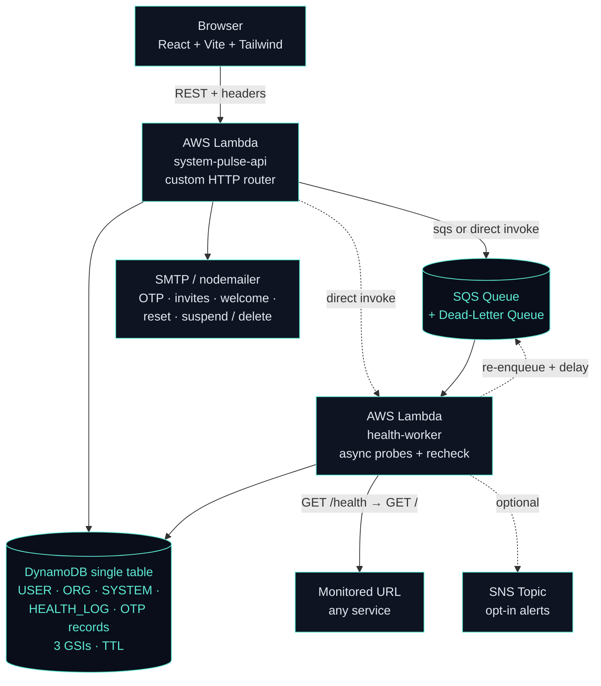
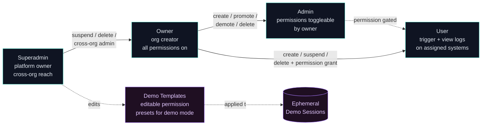
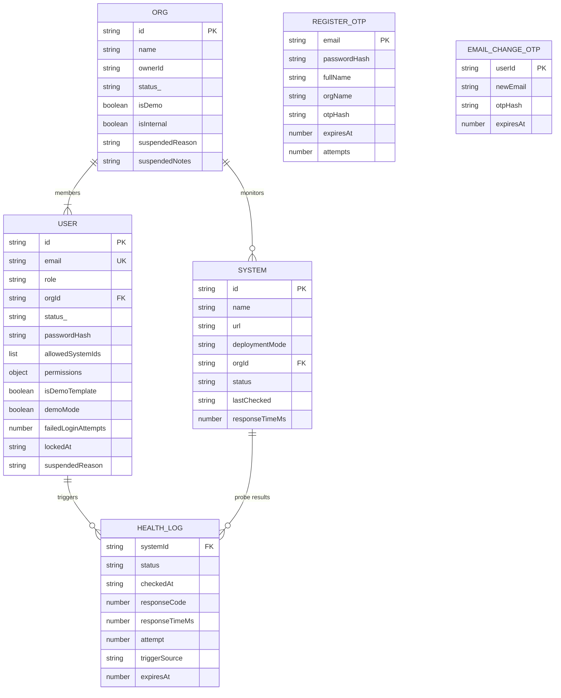
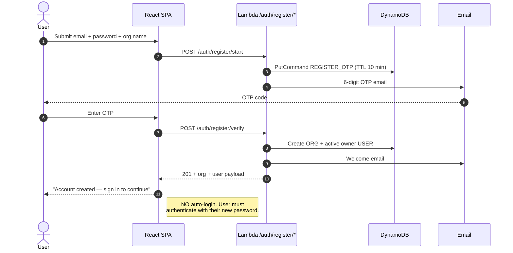
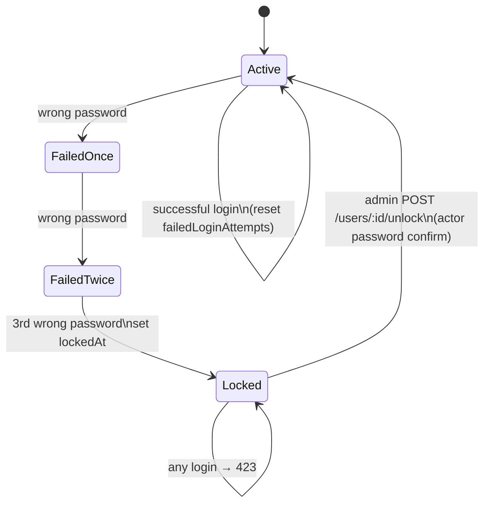
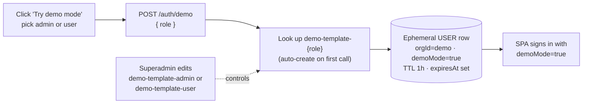

# System Pulse

> A multi-tenant uptime and health-check **SaaS platform** — register URLs, dispatch probes on demand or via background workers, and track status with a 30-day rolling history of every probe result. Built to run on AWS free-tier forever.

System Pulse is a serverless uptime-monitoring platform with a real SaaS shape: self-serve registration with email-OTP verification, organization tenancy, role hierarchy, granular per-user permissions, demo mode with editable permission templates, account lockout, suspend / delete flows with audit-grade reason + notes, and email notifications for every status change.

Frontend is a Vite SPA on Vercel; backend is two Lambdas + DynamoDB + SQS + SNS, all provisioned idempotently from a single GitHub Actions workflow. The whole thing is designed to stay on the AWS perpetual-free tier — $0/month forever at portfolio scale.

---

## Live Demo

- **🌐 Live app:** https://system-pulse-sn3w.vercel.app/login
- **🔧 Backend:** AWS Lambda Function URL (`ap-southeast-1`)
- **🧪 Try Demo Mode:** click *Try demo mode* on the login page — spins up an ephemeral admin or user session in the demo org with destructive actions disabled.

> Cold start may take 1-2 seconds on the first request; subsequent requests are warm.

---

## Table of Contents

1. [What It Does](#what-it-does)
2. [Architecture](#architecture)
3. [Role Hierarchy & Permissions](#role-hierarchy--permissions)
4. [Tech Stack](#tech-stack)
5. [Database Design](#database-design)
6. [Repository Layout](#repository-layout)
7. [API Reference](#api-reference)
8. [Authentication & Onboarding Flows](#authentication--onboarding-flows)
9. [Demo Mode](#demo-mode)
10. [Security](#security)
11. [Deployment & Environment Variables](#deployment--environment-variables)
12. [Cost Breakdown](#cost-breakdown)
13. [Local Development](#local-development)
14. [Author](#author)

---

## What It Does

- **Self-serve registration** — `email + password + org name → 6-digit OTP via email → owner account + free org provisioned`. Validation runs through `validator.isStrongPassword` + `validator.isEmail` so what the live `PasswordChecklist` shows is exactly what the API will accept.
- **Multi-tenant orgs** — every system, user, and invite is scoped to an organization. Owners run their own workspace; the platform owner (`superadmin`) sees everything cross-org via a dedicated Platform tab.
- **Per-user permission toggles** — `canCreateUser`, `canDeleteUser`, `canUpdateUser`, `canCreateSystem`, `canDeleteSystem`, `canUpdateSystem`, `canTriggerHealthChecks`, `canViewLogs`. Owners flip them per user; admins can grant the safe ones.
- **Register systems** by URL, choose a deployment mode (`render` or `standard`), and Pulse runs an immediate probe on creation. Render cold-start mode uses a 90-second wake-up recheck and a 15s HTTP timeout instead of 5s.
- **Probe on demand** from the dashboard, or fan out probes through SQS for batched, resilient checking with automatic re-enqueue (no in-Lambda sleeps).
- **Real-time dashboard** — systems tab polls every 10s (4s when a probe is in flight). Logs panel auto-refreshes while open. Render cold-start results land in the UI without a manual refresh.
- **Persist every probe** as a `HEALTH_LOG` row with response code, latency, attempt number, and trigger source — auto-expired after 30 days via DynamoDB TTL.
- **Email-based onboarding** — owners invite teammates by email; recipient activates via a tokenized link, sets a password, and is forced through a fresh login.
- **Demo mode** — visitors click *Try demo mode* to spawn an ephemeral admin or user session inside the seed-owned demo org. Permissions are sourced from editable **demo template** records, so the platform owner can tune what reviewers can do without redeploying.
- **Account lockout** — 3 consecutive failed logins lock the account; admins/owners with `canUpdateUser` can unlock after a password-confirm.
- **Suspend & delete** — superadmins suspend or hard-delete entire orgs (cascading wipe of users + systems + logs); owners suspend / reactivate / delete users in their own org. Both flows require a dropdown reason + free-text notes; the affected owner / user is emailed.
- **Profile self-service** — every user can rename, change email (with new-email OTP confirmation), and rotate their password from `/profile`. Owners also rename their org from there.
- **SSRF-safe URL probes** — every monitored URL is validated against a deny-list (loopback, RFC1918, link-local 169.254/16, CGNAT, IPv6 unique-local, etc.) before fetch. Defense applied at create time AND every probe to defeat DNS rebinding.

---

## Architecture



### Notable architectural choices

- **Two Lambdas, one shared codebase.** The `api` Lambda handles all incoming HTTP; the `health-worker` Lambda runs probes async — invoked either directly (`HEALTH_TRIGGER_TRANSPORT=lambda-direct`) or via SQS (`=sqs`). Toggling between transports is one env var; no code change.
- **Custom HTTP router** (`router-handler.ts`) — no Express, no `serverless-express`. ~150 lines map `{method, path}` to Lambda handlers with `:param` matching. Saves cold-start time and `node_modules` weight.
- **Render wake-up via SQS re-enqueue, not in-Lambda sleep.** When a Render system fails the first probe, the worker re-enqueues the recheck with `DelaySeconds=90` and exits cleanly. The original code did `await sleep(90s)` in-Lambda — this dropped Lambda compute from ~95s to ~10s per Render probe. Gated on `ENABLE_QUEUE_WORKER_MAPPING`; falls back to in-Lambda sleep when the queue mapping is off.
- **Render-aware HTTP timeout** — Render cold starts can return 6-15 seconds after the first hit. The probe uses 15s for `deploymentMode=render`, 5s for `standard`. Eliminated the false-positive DOWNs the previous fixed-5s timeout produced.
- **Probing strategy** — worker tries `GET <url>/health` first, falls back to `GET <url>` — if either returns 2xx, system is `UP`; otherwise `DOWN`. SSRF-safe URL guard runs at create time and on every probe.
- **Single-table DynamoDB design** keeps reads cheap; entity discriminators on every row enable type-aware queries via `EntityTypeIndex`.
- **TTL auto-purges** old health logs (30 days), expired OTP records (10 minutes), and demo session users (1 hour) — no cron job needed.

---

## Role Hierarchy & Permissions



| Role | Created via | Cross-org | Default permissions |
|------|-------------|-----------|---------------------|
| `superadmin` | Seed script (env-gated) | ✅ | Everything, everywhere |
| `owner` | `/auth/register/verify` | ❌ | Everything in their org |
| `admin` | Owner invite | ❌ | Invite users, edit users, create + edit systems, trigger, view logs |
| `user` / `tester` | Owner / admin invite | ❌ | Trigger + view logs on assigned systems |

**Per-user permission keys** (`UserPermissions` interface):

| Key | What it grants | Owner-only to grant? |
|-----|----------------|----------------------|
| `canCreateUser` | Send invites | No |
| `canCreateSystem` | Register new systems | No |
| `canUpdateSystem` | Edit name / URL / mode | No |
| `canTriggerHealthChecks` | Run probes | No |
| `canViewLogs` | Read probe history | No |
| `canDeleteUser` | Permanently delete users | ⚡ Yes |
| `canDeleteSystem` | Permanently delete systems | ⚡ Yes |
| `canUpdateUser` | Edit permissions, suspend, unlock | ⚡ Yes |

Owners always carry every permission regardless of what's stored. Plain admins can flip the safe permissions on users they invite; only owners can grant the ⚡ ones. Demo templates carry the same shape — editing them tunes future demo sessions.

---

## Tech Stack

### Backend

| Layer | Technology | Why |
|-------|-----------|-----|
| Runtime | Node.js 20 (ESM) + TypeScript 6 | Modern import syntax, latest Node LTS on Lambda |
| Framework | None — direct Lambda handlers | Saves cold-start ms; routing is ~150 LOC |
| Database | **DynamoDB single-table** | 25 GB free perpetually; single-digit ms latency |
| AWS SDK | `@aws-sdk/lib-dynamodb` v3 | Tree-shakable, modern ESM |
| Queue | **SQS** with DLQ + 3-retry redrive | 1M req/mo free, decouples slow probes |
| Pub/Sub | **SNS** topic (opt-in) | Notify on status change |
| Worker invoke | `@aws-sdk/client-lambda` direct invoke | Faster than SQS for low-volume manual triggers |
| Email | nodemailer + SMTP | Free with Gmail / any SMTP provider |
| Validation | **Yup + validator** | Yup for shape, `validator.isEmail` / `isStrongPassword` for the rules — same rules shared between frontend + backend |
| Hashing | scrypt (Node `crypto`) | Built-in, no native deps |
| ID generation | `uuid` v4 | Standard |

### Frontend

| Layer | Technology | Why |
|-------|-----------|-----|
| Framework | React 18 + TypeScript 5 | Familiar, fast |
| Build | Vite 5 | Sub-second HMR, ~10x faster than CRA |
| Styling | Tailwind CSS 4 | Utility-first, latest engine |
| Routing | react-router-dom 6 | Nested layouts, route guards |
| HTTP | `fetch` (native) | No axios needed for this scope |
| Validation | yup + validator (shared with backend) | Live `<PasswordChecklist>` component reflects exactly what the API enforces |
| Hosting | **Vercel** | Hobby tier free, global CDN, automatic deploys |

---

## Database Design

System Pulse uses a **DynamoDB single-table** design. One table holds organizations, users, systems, invites, password-reset tokens, registration OTPs, email-change OTPs, demo templates, and health logs — all distinguished by an `entityType` attribute and PK/SK prefixes.



### Table: `system-pulse-{stage}-table`

The table is provisioned by the deployment workflow with `BillingMode: PAY_PER_REQUEST` (no fixed RCU/WCU costs).

| Item type | PK | SK | What it holds |
|-----------|----|----|---------------|
| **ORG** | `ORG` | `ORG#<id>` | Organization metadata, owner pointer, suspend status |
| **USER** | `USER` | `USER#<id>` | Account, role, status, orgId, permissions, allowedSystemIds, lockedAt |
| **SYSTEM** | `SYSTEM` | `SYS#<uuid>` | Monitored URL, current status, last probe, orgId |
| **HEALTH_LOG** | `SYSTEM#<id>` | `LOG#<iso-time>#<attempt>` | One row per probe attempt (TTL 30 days) |
| **REGISTER_OTP** | `REGISTER_OTP` | `OTP#<email>` | Pending registration with hashed OTP (TTL 10 min) |
| **EMAIL_CHANGE_OTP** | `EMAIL_CHANGE_OTP` | `USER#<id>` | Pending email-change OTP (TTL 10 min) |

### Global Secondary Indexes

| Index | Hash key | Range key | Purpose |
|-------|----------|-----------|---------|
| `EntityTypeIndex` | `entityType` | `status_` | Type-aware queries (list all users, list orgs by status) |
| `InviteTokenIndex` | `inviteToken` | — | Look up invite by opaque token |
| `ResetTokenIndex` | `resetToken` | — | Look up password-reset by opaque token |

**Notable design choices:**

- **One org owns its data**. Every `USER` and `SYSTEM` carries `orgId`. List endpoints filter by the actor's org; superadmin gets cross-org via dedicated `?orgId=` query.
- **Demo templates are real USER rows** with `isDemoTemplate: true` and no `passwordHash`. They configure demo-mode permissions but cannot log in. Hard-blocked from deletion.
- **Cascading soft & hard wipes** — org delete is a hard cascade (users + systems + logs + org). Org suspend is a soft state (`status_=Suspended`) that login.ts honors.
- **TTL on `expiresAt`** auto-purges health logs after 30 days, OTP records after 10 minutes, and demo session users after 1 hour. Zero ops cost, no cron.
- **Single-table** keeps reads cheap; entity discriminators on every row enable type-aware queries via `EntityTypeIndex`.

---

## Repository Layout

```
system-pulse/
├── .github/workflows/deployment.yml   # Idempotent infra+code deploy (~600 lines)
├── backend/
│   ├── package.json                   # Node 20, ESM, AWS SDK v3
│   ├── tsconfig.json
│   └── src/
│       ├── handler.ts                 # Re-exports every Lambda function
│       ├── router-handler.ts          # Single-Lambda router with :param matching
│       ├── config/                    # config.ts, db.ts (DDB doc client)
│       ├── functions/
│       │   ├── auth/                  # login, forgot/reset, register-{start,verify,resend}, demo-start
│       │   ├── user/                  # invite, accept, list, get, delete,
│       │   │                          # update-permissions, change-role, unlock
│       │   ├── me/                    # get-me, update-name, update-email-{start,verify}, update-password
│       │   ├── org/                   # list-orgs, update-org, suspend-org, delete-org
│       │   └── health/                # check, list, update, delete, trigger,
│       │                              # process-health-queue, get-system-logs
│       ├── services/
│       │   ├── health-service.ts      # Persist + probe + log (Render-aware timeout)
│       │   ├── user-service.ts        # createActiveOwner, createDemoUser, createUserInvitation
│       │   ├── organization-service.ts
│       │   ├── otp-service.ts         # Registration OTP store
│       │   ├── email-change-otp-service.ts
│       │   ├── email-service.ts       # OTP / welcome / invite / reset / status-change
│       │   ├── notification-service.ts # SNS publish (opt-in)
│       │   ├── queue-service.ts       # SQS send/receive
│       │   └── worker-invoke-service.ts # Direct Lambda invoke
│       ├── types/                     # user (with UserPermissions), organization, health
│       ├── utils/
│       │   ├── actor-auth.ts          # Header parsing + DB-backed actor verification
│       │   ├── error-handler.ts       # CORS + error helpers
│       │   ├── frontend-url.ts        # Resolve link host from env or request headers
│       │   ├── health-workflow.ts     # resolveDeploymentMode, isRenderUrl
│       │   ├── parse.ts               # JSON body parser with 256 KB cap
│       │   ├── password.ts            # scrypt hash + timing-safe verify
│       │   ├── rate-limit.ts          # Per-actor + per-IP rolling counter
│       │   ├── rbac.ts                # hasPermission, isOwner, canChangeRole
│       │   ├── sanitize.ts            # validator.escape for email bodies
│       │   └── url-safety.ts          # SSRF guard (loopback, RFC1918, link-local, IPv6)
│       ├── validation/                # yup + validator schemas, shared with frontend
│       └── scripts/seed-users.ts      # Env-gated bootstrap (no creds in source)
└── frontend/
    ├── package.json                   # React 18, Vite 5, Tailwind 4
    ├── vite.config.ts
    ├── vercel.json
    ├── public/favicon.svg
    ├── assets/                        # Logo variants
    └── src/
        ├── App.tsx                    # Routes + role guards
        ├── main.tsx
        ├── components/                # Nav, AestheticSelect, PasswordChecklist
        ├── hooks/                     # useAuth (with .can()), useTheme
        ├── pages/                     # Login (tabbed), AcceptInvite, AdminDashboard,
        │                              # TesterDashboard, Profile, ForgotPassword,
        │                              # ResetPassword, Register, Home, Systems
        ├── services/                  # api.ts (typed client + endpoints)
        ├── styles/index.css           # Green-light/green-dark theme
        └── utils/                     # validation.ts (yup+validator), health-status, security
```

---

## API Reference

### Auth & registration

| Method | Path | Auth | Purpose |
|--------|------|------|---------|
| POST | `/auth/login` | none | Email + password → session payload (with `permissions`) |
| POST | `/auth/forgot-password` | none | Email a password-reset link |
| POST | `/auth/reset-password` | reset token | Set new password |
| POST | `/auth/register/start` | none | Validate + send 6-digit OTP to a new email |
| POST | `/auth/register/verify` | OTP | Provision an org + active **owner** account |
| POST | `/auth/register/resend` | none | Resend OTP (cooldown + cap) |
| POST | `/auth/demo` | none | Spawn ephemeral demo admin / user session |

### Profile (the signed-in user)

| Method | Path | Auth | Purpose |
|--------|------|------|---------|
| GET | `/me` | session | Refresh canonical session payload |
| POST | `/me/name` | session + password | Update display name |
| POST | `/me/email/start` | session + password | Send OTP to a new email |
| POST | `/me/email/verify` | session + OTP | Commit the email change |
| POST | `/me/password` | session + current pwd | Rotate password (clears any lockout) |

### Users

| Method | Path | Auth | Purpose |
|--------|------|------|---------|
| GET | `/users` | admin tier | List users (org-scoped, role-filtered) |
| GET | `/users/:id` | admin tier | Detail for one user |
| POST | `/users/invite` | `canCreateUser` | Invite a teammate (admin or user role) |
| POST | `/users/invite/accept` | invite token | Set password + activate |
| POST | `/users/:id/permissions` | `canUpdateUser` | System access + status + permissions in one call |
| POST | `/users/:id/role` | owner | Promote / demote (assignable: admin, user, tester) |
| POST | `/users/:id/unlock` | `canUpdateUser` + pwd | Clear failed-login lockout |
| DELETE | `/users/:id` | `canDeleteUser` + pwd | Permanent delete + email user (with reason / notes) |

### Orgs

| Method | Path | Auth | Purpose |
|--------|------|------|---------|
| GET | `/orgs` | superadmin | Cross-org platform view (with member + system counts) |
| PATCH | `/orgs/:id` | owner | Rename the organization |
| POST | `/orgs/:id/suspend` | superadmin | Suspend org + email owner (reason + notes) |
| POST | `/orgs/:id/unsuspend` | superadmin | Reactivate org + email owner |
| DELETE | `/orgs/:id` | superadmin + pwd | Hard cascade wipe + email owner (reason + notes) |

### Systems

| Method | Path | Auth | Purpose |
|--------|------|------|---------|
| GET | `/systems` | session | List org systems (or `?orgId=...` for superadmin drill-down) |
| POST | `/systems` | `canCreateSystem` | Register a system + initial probe |
| PATCH | `/systems/:id` | `canUpdateSystem` | Edit name / URL / deployment mode |
| DELETE | `/systems/:id` | `canDeleteSystem` + pwd | Permanent delete + cascade logs |
| POST | `/systems/:id/trigger` | `canTriggerHealthChecks` | On-demand probe (queued) |
| GET | `/systems/:id/logs` | `canViewLogs` | Recent probe history |

---

## Authentication & Onboarding Flows

### Self-serve registration (multi-tenant entry point)



### Account lockout & unlock



### Forgot password & invite acceptance

Both flows email a tokenized link. The `token` is consumed as a query string and **never shown to the user**. After password is set, the SPA force-clears any existing session and routes to `/login` so the user authenticates fresh.

---

## Demo Mode



- **Templates**: `demo-template-admin` and `demo-template-user` are real USER records in the demo org with `isDemoTemplate: true` and no password. They can't log in, can't be deleted (server-enforced), and their `permissions` field is the live source of truth for fresh demo sessions.
- **First-call auto-provision**: the first `/auth/demo` request creates the missing template with the role's defaults. Idempotent on subsequent calls.
- **Edit-and-go**: the superadmin opens *Platform → Demo org → Settings on the template* → tweak permissions → Save. The very next *Try demo mode* click reads the new permissions. No redeploy.
- **Demo guards**: `rejectIfDemo()` blocks every destructive endpoint. Demo session creation is rate-limited; sessions auto-clean via DDB TTL.

---

## Security

| Layer | Defense |
|-------|---------|
| Email enumeration on register | Surfaced clearly per product brief — 409 `"already registered"` with inline *Sign in* / *Forgot password* CTAs |
| Password storage | scrypt (`<salt>:<derived>`), timing-safe compare on verify |
| Password rules | 8–128 chars, mixed case + number + symbol via `validator.isStrongPassword`; rules shared FE + BE |
| Failed-login lockout | `MAX_FAILED_LOGIN_ATTEMPTS = 3`; HTTP 423 on locked accounts |
| OTP brute-force | 6 attempts max, hashed at rest, 30s resend cooldown, 5 resends max |
| SSRF on monitored URLs | `validator.isURL` (http/https only) + IP-range deny-list (loopback, RFC1918, link-local, CGNAT, IPv6 unique-local). Enforced at create time AND every probe (defeats DNS rebinding) |
| Request body parser | 256 KB cap → HTTP 413 |
| Rate limiting | Per-actor + per-IP rolling counters on every mutating endpoint and now every read endpoint |
| Email body XSS | `validator.escape` every user-supplied string before HTML interpolation |
| CSRF | N/A — header-based auth, no cookies |
| CORS | Allow-list includes the headers the SPA actually sends (`x-org-id`, `x-demo-mode`, etc.) |
| Click-spam on dangerous actions | `useRef<Set<string>>` keyed by action id — synchronous in-flight guard so React batching can't fire two emails on a double click |
| Secret hygiene | Seed credentials env-gated; no email or password in source. Default seed email is the platform owner's personal address; the password is required from env |

---

## Deployment & Environment Variables

The deploy workflow (`.github/workflows/deployment.yml`) is **idempotent** — re-running on a fresh AWS account stands up the entire system from scratch in ~3 minutes. It provisions the DDB table + GSIs, the SQS queue + DLQ + redrive policy, the SNS topic, the IAM role + inline policy, both Lambdas + their Function URLs, and the SQS-event-source mapping (gated on `ENABLE_QUEUE_WORKER_MAPPING`).

### Required env / secrets (CI)

| Variable | Purpose |
|----------|---------|
| `AWS_ACCESS_KEY_ID` / `AWS_SECRET_ACCESS_KEY` | AWS credentials (deploy + runtime via Lambda role) |
| `EMAIL_USER` / `EMAIL_PASS` | Gmail (or any SMTP) creds for nodemailer |

### Optional env (defaults shown)

| Variable | Default | Notes |
|----------|---------|-------|
| `STAGE` | `dev` | Deployment stage / table suffix |
| `AWS_REGION` | `ap-southeast-1` | |
| `FRONTEND_URL` | (empty) | Used in email links; falls back to request `Origin` / `Referer` if unset |
| `RENDER_WAKEUP_DELAY_SECONDS` | `90` | Render cold-start recheck delay |
| `INVITE_ELIGIBILITY_HOURS` | `24` | Invite-token lifetime |
| `PASSWORD_RESET_ELIGIBILITY_MINUTES` | `30` | Reset-token lifetime |
| `REGISTER_OTP_TTL_MINUTES` | `10` | Registration / email-change OTP lifetime |
| `DEMO_SESSION_TTL_SECONDS` | `3600` | Demo user TTL (DDB-cleaned) |
| `HEALTH_TRIGGER_TRANSPORT` | `lambda-direct` | `sqs` or `lambda-direct` |
| `ENABLE_QUEUE_WORKER_MAPPING` | `false` | Set `true` to use the SQS path + cheap re-enqueue |
| `HEALTH_RECHECK_VIA_SQS` | `true` | Render recheck strategy: re-enqueue with delay (vs in-Lambda sleep) |
| `ENABLE_HEALTH_LOGS` | `true` | Persist HEALTH_LOG rows |
| `ENABLE_SNS_NOTIFICATIONS` | `false` | Publish status changes to SNS |
| `SHOW_INVITE_LINK` | `false` | Echo invite link in API response (dev only) |
| `SHOW_REGISTER_OTP` | `false` | Echo OTP in API response (dev only) |

### Seed-only env (run `npm run seed -- <table>`)

| Variable | Default | Notes |
|----------|---------|-------|
| `SEED_SUPERADMIN_EMAIL` | `sonioralphkenneth@gmail.com` | Platform owner's email |
| `SEED_SUPERADMIN_PASSWORD` | — | **Required** to seed; password never in source |
| `SEED_SUPERADMIN_NAME` | `Platform Admin` | |
| `SEED_DEMO_ADMIN_EMAIL` / `SEED_DEMO_ADMIN_PASSWORD` | — | Optional seeded demo admin login |
| `SEED_DEMO_USER_EMAIL` / `SEED_DEMO_USER_PASSWORD` | — | Optional seeded demo user login |

If no seed env vars are set, the script still creates the demo org + the platform org but no user accounts. Idempotent — safe to re-run.

---

## Cost Breakdown

Designed for **$0/month forever** — every line of the stack runs on a free tier with no expiry.

| Service | Free tier | We use | Headroom |
|---------|-----------|--------|----------|
| AWS Lambda | 1M invocations/mo + 400K GB-s | ~3K invocations/mo | 99.7% |
| DynamoDB (PAY_PER_REQUEST) | 25 GB storage + 25 R/W units (perpetual) | <50 MB | 99%+ |
| SQS | 1M requests/mo | <500 req/mo | 99.95% |
| SNS | 1M publishes/mo | <100/mo | 99.99% |
| CloudWatch Logs | 5 GB ingestion/mo | <50 MB | 99% |
| Vercel Hobby | 100 GB bandwidth, unlimited deploys | <1 GB/mo | 99% |
| SMTP (Gmail) | 500/day | <10/day | 97%+ |

**Monthly total: $0/month**

The Render-recheck SQS optimization (re-enqueue instead of in-Lambda sleep) was specifically motivated by this constraint — it dropped Lambda compute from ~95s to ~10s per Render probe, pushing the platform deeper into the free-tier headroom.

---

## Local Development

```bash
# Backend
cd backend
npm install
npm run typecheck     # tsc --noEmit
npm run build         # tsc → dist/
npm run seed -- <table-name>   # bootstrap demo org + (optional) superadmin

# Frontend
cd frontend
npm install
npm run dev           # Vite, hot reload at :5173
```

The SPA expects `VITE_API_URL` to point at the Lambda Function URL (or a local emulator). For local dev with the seeded superadmin, set `SHOW_REGISTER_OTP=true` to get the OTP in the API response (instead of waiting for email).

---

## Author

**Ralph Kenneth Sonio** — Cloud-Native Backend & QA Engineer
[Portfolio](https://asciente-portfolio.vercel.app) · [GitHub](https://github.com/Asciente-rks)
